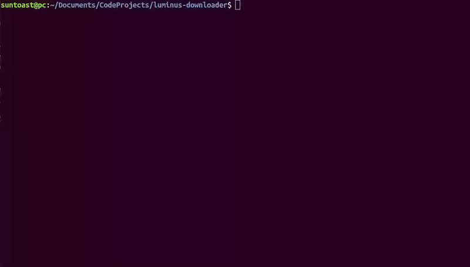

# LumiNUS Downloader

This downloader compares your local directory to LumiNUS, and pulls all new files and folders from LumiNUS into the appropriate location in your local directory.

## Setting up

There are two files you first have to set up:

#### `CONFIG.txt`

Copy the file `CONFIG_EXAMPLE.txt` into a new file `CONFIG.txt`.

Replace the following fields accordingly:
* `username` NUSNET username
* `password` NUSNET password
* `directory_path` Path of your local directory to compare to LumiNUS, *relative to your home directory*
* `print` Whether you want to display extra information or not -- either `true` or `false`

#### `MODULES.txt`

Copy the file `MODULES_EXAMPLE.txt` into a new file `MODULES.txt`.

Each line should be present for each module that you have in your local directory. It should be in the format `<LumiNUS module name>: <Local folder name>`. This helps to map the LumiNUS module to your local folder.

## Running the script

Run `npm install`, then run the main script using `node main.js`.

